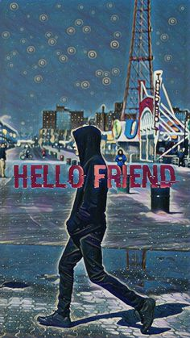

哈喽，这篇是建站的第一篇文章，用来展示博客可以使用的丰富的内容类型，也算是为日后写作的一个速查表yeah！

<!--more-->

# 这里是背景音乐

<iframe frameborder="no" border="0" marginwidth="0" marginheight="0" width=330 height=86 src="//music.163.com/outchain/player?type=2&id=2103901&auto=1&height=66"></iframe>

直接从网页云网页端生成的html外链代码复制而来：

```html
<iframe frameborder="no" border="0" marginwidth="0" marginheight="0" width=330 height=86 src="//music.163.com/outchain/player?type=2&id=2103901&auto=1&height=66"></iframe>
```

# 纯MD 语法回顾及写作规范

## 二级标题示范

### 三级标题

#### 四级标题

##### 五级标题

###### 六级标题

正文

### Heading Best Practices

Markdown applications don’t agree on how to handle a missing space between the number signs (`#`) and the heading name. For compatibility, always put a space between the number signs and the heading name.

| ✅ Do this            | ❌ Don't do this     |
| -------------------- | ------------------- |
| `# Here's a Heading` | `#Here's a Heading` |

You should also put blank lines before and after a heading for compatibility.

| ✅ Do this                                                           | ❌ Don't do this                                                          |
| ------------------------------------------------------------------- | ------------------------------------------------------------------------ |
| `Try to put a blank line before...# Heading...and after a heading.` | `Without blank lines, this might not look right.# HeadingDon't do this!` |

### Paragraph Best Practices

Unless the [paragraph is in a list](https://www.markdownguide.org/basic-syntax/#paragraphs), don’t indent paragraphs with spaces or tabs.



<div>
<table class="table table-bordered">
  <thead class="thead-light">
    <tr>
      <th>✅  Do this</th>
      <th>❌  Don't do this</th>
    </tr>
  </thead>
  <tbody>
    <tr>
      <td>
        <code class="highlighter-rouge">
          Don't put tabs or spaces in front of your paragraphs.<br><br>

          Keep lines left-aligned like this.<br><br>
        </code>
      </td>
      <td>
        <code class="highlighter-rouge">
            This can result in unexpected
        formatting problems.<br><br>
    
          Don't add tabs or spaces in front of paragraphs.
        </code>
      </td>
    </tr>

</tbody>
</table>
</div>


## 这里是表格

| 1   | 2   | 3   |
| --- | --- | --- |
| 4   |     |     |
|     | 5   |     |
|     |     | 6   |

## 这里是引用

> 好好学习，天天向上！！！

### 多行引用

Blockquotes can contain multiple paragraphs. Add a `>` on the blank lines between the paragraphs.

```markdown
> Dorothy followed her through many of the beautiful rooms in her castle.
>
> The Witch bade her clean the pots and kettles and sweep the floor and keep the fire fed with wood.
```

The rendered output looks like this:

> Dorothy followed her through many of the beautiful rooms in her castle.
> 
> The Witch bade her clean the pots and kettles and sweep the floor and keep the fire fed with wood.

### 嵌入引用

Blockquotes can be nested. Add a `>>` in front of the paragraph you want to nest.

```markdown
> Dorothy followed her through many of the beautiful rooms in her castle.
>
>> The Witch bade her clean the pots and kettles and sweep the floor and keep the fire fed with wood.
```

The rendered output looks like this:

> Dorothy followed her through many of the beautiful rooms in her castle.
> 
> > The Witch bade her clean the pots and kettles and sweep the floor and keep the fire fed with wood.

### 有其他类型的引用

Blockquotes can contain other Markdown formatted elements. Not all elements can be used — you’ll need to experiment to see which ones work.

```
> #### The quarterly results look great!
>
> - Revenue was off the chart.
> - Profits were higher than ever.
>
>  *Everything* is going according to **plan**.
```

The rendered output looks like this:

> #### The quarterly results look great!
> 
> - Revenue was off the chart.
> - Profits were higher than ever.
> 
> *Everything* is going according to **plan**.

### Blockquotes Best Practices



<table class="table table-bordered">
  <thead class="thead-light">
    <tr>
      <th>✅  Do this</th>
      <th>❌  Don't do this</th>
    </tr>
  </thead>
  <tbody>
    <tr>
      <td>
        <code class="highlighter-rouge">
        Try to put a blank line before...<br><br>

        > This is a blockquote<br><br>
    
        ...and after a blockquote.
        </code>
      </td>
      <td>
        <code class="highlighter-rouge">
        Without blank lines, this might not look right.<br>
        > This is a blockquote<br>
        Don't do this!
        </code>
      </td>
    </tr>

</tbody>
</table>



## 这里是列举

- 我很好

- 我还行

- 我非常好

- 很棒

## 这里是分隔线

---

### Horizontal Rule Best Practices

For compatibility, put blank lines before and after horizontal rules.



<table class="table table-bordered">
  <thead class="thead-light">
    <tr>
      <th>✅  Do this</th>
      <th>❌  Don't do this</th>
    </tr>
  </thead>
  <tbody>
    <tr>
      <td>
        <code class="highlighter-rouge">
        Try to put a blank line before...<br><br>

        ---<br><br>
    
        ...and after a horizontal rule.
        </code>
      </td>
      <td>
        <code class="highlighter-rouge">
        Without blank lines, this would be a heading.<br>
        ---<br>
        Don't do this!
        </code>
      </td>
    </tr>

</tbody>
</table>



## 这里是图片



## 这里是URL和Email引用

To quickly turn a URL or email address into a link, enclose it in angle brackets.

```
[Duck Duck Go](https://duckduckgo.com "The best search engine for privacy")
<https://www.markdownguide.org>
<fake@example.com>
I love supporting the **[EFF](https://eff.org)**.
This is the *[Markdown Guide](https://www.markdownguide.org)*.
See the section on [`code`](#code).
```

The rendered output looks like this:

[Duck Duck Go](https://duckduckgo.com "The best search engine for privacy")
[https://www.markdownguide.org](https://www.markdownguide.org/)
[fake@example.com](mailto:fake@example.com)
I love supporting the **[EFF](https://eff.org)**.
This is the *[Markdown Guide](https://www.markdownguide.org)*.
See the section on [`code`](#code).

## 转义字符

You can use a backslash to escape the following characters.



<table class="table table-bordered">
  <thead class="thead-light">
    <tr>
      <th>Character</th>
      <th>Name</th>
    </tr>
  </thead>
  <tbody>
    <tr>
      <td>\</td>
      <td>backslash</td>
    </tr>
    <tr>
      <td>`</td>
      <td>backtick (see also <a href="#escaping-backticks">escaping backticks in code</a>)</td>
    </tr>
    <tr>
      <td>*</td>
      <td>asterisk</td>
    </tr>
    <tr>
      <td>_</td>
      <td>underscore</td>
    </tr>
    <tr>
      <td>{ }</td>
      <td>curly braces</td>
    </tr>
    <tr>
      <td>[ ]</td>
      <td>brackets</td>
    </tr>
    <tr>
      <td>< ></td>
      <td>angle brackets</td>
    </tr>
    <tr>
      <td>( )</td>
      <td>parentheses</td>
    </tr>
    <tr>
      <td>#</td>
      <td>pound sign</td>
    </tr>
    <tr>
      <td>+</td>
      <td>plus sign</td>
    </tr>
    <tr>
      <td>-</td>
      <td>minus sign (hyphen)</td>
    </tr>
    <tr>
      <td>.</td>
      <td>dot</td>
    </tr>
    <tr>
      <td>!</td>
      <td>exclamation mark</td>
    </tr>
    <tr>
      <td>|</td>
      <td>pipe (see also <a href="/extended-syntax/#escaping-pipe-characters-in-tables">escaping pipe in tables</a>)</td>
    </tr>
  </tbody>
</table>


# Hexo 对格式文本的延伸

## 这里是画廊

<div class="justified-gallery">


</div>

```html
<div class="justified-gallery">


</div>
```

## 这里是数学公式

### LaTex

这是一个行内公式：\\(ax^2+bx+c=0\\)。这是另一个行内公式：$ax^2+bx+c>0$。

这是一个块状公式：
$$\displaystyle \frac{1}{\Bigl(\sqrt{\phi \sqrt{5}}-\phi\Bigr) e^{\frac25 \pi}} = 
1+\frac{e^{-2\pi}} {1+\frac{e^{-4\pi}} {1+\frac{e^{-6\pi}} 
{1+\frac{e^{-8\pi}} {1+\cdots} } } }$$

这是另一个块状公式：
\\[f(x) = \int_{-\infty}^\infty\hat f(\xi)e^{2 \pi i \xi x}d\xi\\]

或者使用\\(\LaTeX\\)环境：
\\begin{equation}
A =
\\begin{bmatrix}
  a & b \\\\
  c & c
\\end{bmatrix}
\\end{equation}

## 这里是代码块

```python
print('welcome to my blog')
```

```
``` [language] [title] [url] [link text]
code snippet
```

```
其中，各参数意义如下：

- langugae：语言名称，引导渲染引擎正确解析并高亮显示关键字
- title：代码块标题，将会显示在左上角
- url：链接地址，如果没有指定 link text 则会在右上角显示 link
- link text：链接名称，指定 url 后有效，将会显示在右上角

url 必须为有效链接地址才会以链接的形式显示在右上角，否则将作为标题显示在左上角。以 url 为分界，左侧除了第一个单词会被解析为 language，其他所有单词都会被解析为 title，而右侧的所有单词都会被解析为 link text。

如果不想填写 title，可以在 language 和 url 之间添加至少三个空格。

## 插入Swig代码

如果需要在页面内插入 Swig 代码，包括原生 HTML 代码，JavaScript 脚本等，可以通过 raw 标签来禁止 Markdown 引擎渲染标签内的内容。语法如下：

```markdown

content

```

## 这里是按钮

<div class="buttons">
  <button class="button is-info">Info</button>
  <button class="button is-success">Success</button>
  <button class="button is-warning">Warning</button>
  <button class="button is-danger">Danger</button>
</div>

```html
<div class="buttons">
  <button class="button is-info">Info</button>
  <button class="button is-success">Success</button>
  <button class="button is-warning">Warning</button>
  <button class="button is-danger">Danger</button>
</div>
```

当然还可以为按钮增加事件

<button class="button is-info" onclick="showHitokoto(event)">显示一言</button>

<blockquote class="hitokoto">↑↑↑ 试着点击“显示一言”！</blockquote>

<script>
function showHitokoto (event) {
    event.target.classList.add('is-loading');
    $.ajax({
        type: 'GET',
        url: 'https://v1.hitokoto.cn/',
        success: function (data) {
            $('.hitokoto').text(data.hitokoto);
            event.target.classList.remove('is-loading');
        }
    });
}
</script>

## 这里是进度条

<progress class="progress is-info" value="20" max="100"></progress>
<progress class="progress is-success" value="40" max="100"></progress>
<progress class="progress is-warning" value="60" max="100"></progress>
<progress class="progress is-danger" value="80" max="100"></progress>
<progress class="progress is-info" max="100"></progress>

## 这里是标签页

<div class="tabs is-toggle"><ul>
<li class="is-active"><a onclick="onTabClick(event)">
<span class="icon is-small"><i class="fas fa-image" aria-hidden="true"></i></span>
<span>Pictures</span>
</a></li>
<li><a onclick="onTabClick(event)">
<span class="icon is-small"><i class="fas fa-music" aria-hidden="true"></i></span>
<span>Music</span>
</a></li>
<li><a onclick="onTabClick(event)">
<span class="icon is-small"><i class="fas fa-film" aria-hidden="true"></i></span>
<span>Videos</span>
</a></li>
<li><a onclick="onTabClick(event)">
<span class="icon is-small"><i class="far fa-file-alt" aria-hidden="true"></i></span>
<span>Documents</span>
</a></li>
</ul></div>
<div id="Pictures" class="tab-content" style="display: block;">
[Pixabay](https://pixabay.com/zh/) 是全球知名的图库网站及充满活力的创意社区,拥有上百万张免费正版高清照片素材,涵盖风景、人物、动态、静物等多种分类,你可以在任何地方使用 Pixabay 图库中的素材...
</div>
<div id="Music" class="tab-content">
[网易云音乐](https://music.163.com/) 是一款专注于发现与分享的音乐产品,依托专业音乐人、DJ、好友推荐及社交功能,为用户打造全新的音乐生活。
</div>
<div id="Videos" class="tab-content">
[哔哩哔哩](https://www.bilibili.com/) 是国内知名的视频弹幕网站,这里有最及时的动漫新番,最棒的ACG氛围,最有创意的Up主。大家可以在这里找到许多欢乐。
</div>
<div id="Documents" class="tab-content">
[石墨文档](https://shimo.im/) 是全新一代云 Office 办公软件,支持多人在线协作编辑文档和表格,独有内容级安全,全过程留痕可追溯。PC 端和移动端全覆盖,随时随地远程办公。即写即存...
</div>

<style type="text/css">
.content .tabs ul { margin: 0; }
.tab-content { display: none; }
</style>

<script>
function onTabClick (event) {
    var tabTitle = $(event.currentTarget).children('span:last-child').text();
    $('.article .content .tab-content').css('display', 'none');
    $('.article .content .tabs li').removeClass('is-active');
    $('#' + tabTitle).css('display', 'block');
    $(event.currentTarget).parent().addClass('is-active');
}
</script>

## 这里是彩色突出

<div class="notification is-info">
[Icarus](https://blog.zhangruipeng.me/hexo-theme-icarus/) 主题以白色的简洁为主，但有时候我们希望在文章中用**特别的样式**注明一些内容，*markdown* 语法就不够用了，所以在此分享一下我的高级玩法。
</div>

<div class="notification is-success">
[Icarus](https://blog.zhangruipeng.me/hexo-theme-icarus/) 主题以白色的简洁为主，但有时候我们希望在文章中用**特别的样式**注明一些内容，*markdown* 语法就不够用了，所以在此分享一下我的高级玩法。
</div>

<div class="notification is-warning">
[Icarus](https://blog.zhangruipeng.me/hexo-theme-icarus/) 主题以白色的简洁为主，但有时候我们希望在文章中用**特别的样式**注明一些内容，*markdown* 语法就不够用了，所以在此分享一下我的高级玩法。
</div>

<div class="notification is-danger">
[Icarus](https://blog.zhangruipeng.me/hexo-theme-icarus/) 主题以白色的简洁为主，但有时候我们希望在文章中用**特别的样式**注明一些内容，*markdown* 语法就不够用了，所以在此分享一下我的高级玩法。
</div>

<article class="message is-info"><div class="message-body">
[Icarus](https://blog.zhangruipeng.me/hexo-theme-icarus/) 主题以白色的简洁为主，但有时候我们希望在文章中用**特别的样式**注明一些内容，*markdown* 语法就不够用了，所以在此分享一下我的高级玩法。
</div></article>

<article class="message is-success"><div class="message-body">
[Icarus](https://blog.zhangruipeng.me/hexo-theme-icarus/) 主题以白色的简洁为主，但有时候我们希望在文章中用**特别的样式**注明一些内容，*markdown* 语法就不够用了，所以在此分享一下我的高级玩法。
</div></article>

<article class="message is-warning"><div class="message-body">
[Icarus](https://blog.zhangruipeng.me/hexo-theme-icarus/) 主题以白色的简洁为主，但有时候我们希望在文章中用**特别的样式**注明一些内容，*markdown* 语法就不够用了，所以在此分享一下我的高级玩法。
</div></article>

<article class="message is-danger"><div class="message-body">
[Icarus](https://blog.zhangruipeng.me/hexo-theme-icarus/) 主题以白色的简洁为主，但有时候我们希望在文章中用**特别的样式**注明一些内容，*markdown* 语法就不够用了，所以在此分享一下我的高级玩法。
</div></article>

## 这里是站内链接

可通过如下语法引入站内文章的地址或链接：

```


```

其中，`slug` 表示 `_post` 目录下的 Markdown 文件名。

`post_path` 标签将会渲染为文章的地址，即 `permalink`；而 `post_link` 标签将会渲染为链接，可以通过 `title` 指定链接标题。

## 这里是脚注

需要**安装**[hexo-reference](https://github.com/kchen0x/hexo-reference)插件！

basic footnote[^1]
here is an inline footnote[^2](inline footnote)
and another one[^3]
and another one[^4]

[^1]: basic footnote content
[^3]: paragraph
footnote
content

[^4]: footnote content with some [markdown](https://en.wikipedia.org/wiki/Markdown)

## 你知道的太多了



<style type="text/css">
.heimu { color: #000; background-color: #000; }
.heimu:hover { color: #fff; }
</style>


**iMaeGoo** 出自独立游戏 [World of Goo](https://store.steampowered.com/app/22000/) 里小粘球的叫声，读作 /ɪ'mæɡu/ <span class="heimu">不是爱妹狗啊</span>，在家里电脑还是个大头（CRT）的时候就在玩了，其实头像也是在当时设定的，一直沿用至今。<span class="heimu">找不到女朋友誓不改头像</span>

## 图片来源声明

<a class="tag is-dark is-medium" href="https://www.vecteezy.com/free-vector/vector-landscape" target="_blank">
<span class="icon"><i class="fas fa-camera"></i></span>  
Vector Landscape Vectors by Vecteezy
</a>

# 这里是访客地球

<script type="text/javascript" src="//rf.revolvermaps.com/0/0/6.js?i=5fmglyd5vis&m=7&c=e63100&cr1=ffffff&f=arial&l=0&bv=90&lx=-420&ly=420&hi=20&he=7&hc=a8ddff&rs=80" async="async"></script>

# 鸣谢

本站的建立离不开许多博主先前的工作，其中特别感谢的有：

- [IMaeGoo]: (https://www.imaegoo.com/)，能找到的中文最好的icarus魔改博主，本站借鉴了其中icarus 4夜间模式、拼音检索、Bulma美化等部分的内容。
- [Xinyu Liu]:(https://www.alphalxy.com/), 很好了实现了icarus 4中文章的布局格式等美化。
